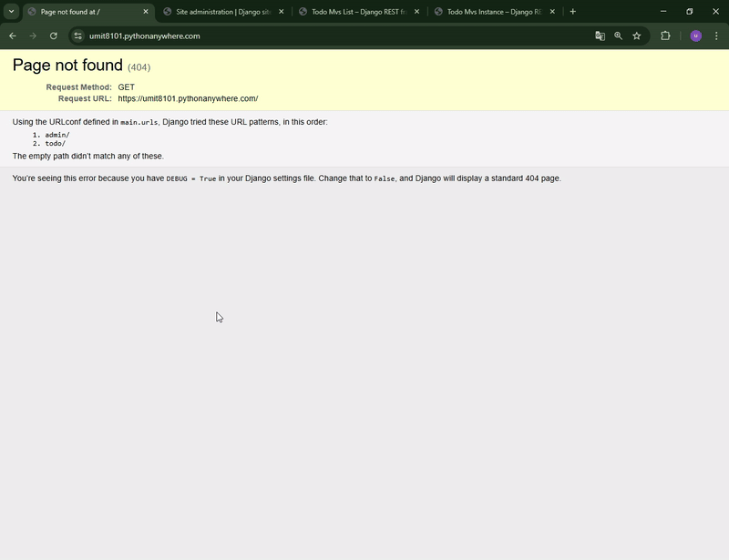
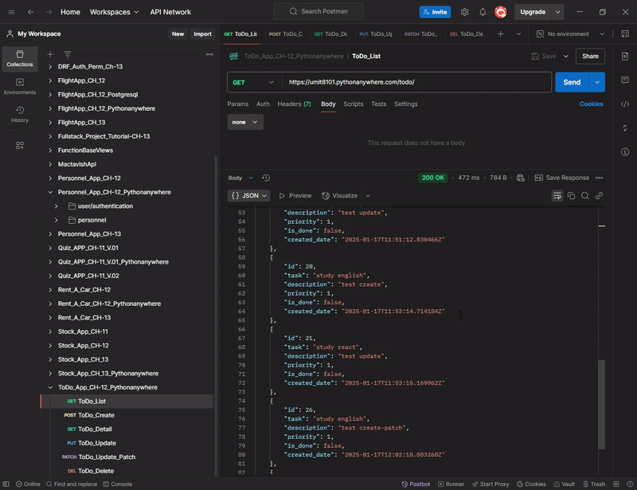

<!-- Please update value in the {}  -->

<h1 align="center">Project_Django_Rest_Framework_ToDo_Appp</h1>

<p align="center"><strong>
  ✅ A simple ToDo application built with Django Rest Framework, providing an API to manage tasks efficiently. ✅
</strong></p>

<!-- <div align="center">
  <h3>
    <a href="https://umit8101.pythonanywhere.com/">
      Demo
    </a>
     | 
    <a href="https://umit8101.pythonanywhere.com/">
      Project
    </a>
 
  </h3>
</div> -->

<!-- TABLE OF CONTENTS -->

## Table of Contents

- [Table of Contents](#table-of-contents)
- [API Endpoints](#api-endpoints)
  - [Todo Endpoints:](#todo-endpoints)
- [API Testing](#api-testing)
- [Overview](#overview)
- [Built With](#built-with)
- [How To Use](#how-to-use)
  - [Example Usage](#example-usage)
- [About This Project](#about-this-project)
- [Key Features](#key-features)
- [Contact](#contact)

## API Endpoints

This API provides the following endpoints:

### Todo Endpoints:
| Method | URL                                             | Explanation          |
|--------|-------------------------------------------------|----------------------|
| GET    | `https://umit8101.pythonanywhere.com/todo/`     | List all todos       |
| POST   | `POST https://umit8101.pythonanywhere.com/todo/`| Create a new todo    |
| GET    | `https://umit8101.pythonanywhere.com/todo/26/`  | View a specific todo |
| PUT    | `https://umit8101.pythonanywhere.com/todo/26/`  | Update a todo        |
| DELETE | `https://umit8101.pythonanywhere.com/todo/26/`  | Delete a todo        |

## API Testing

Postman Collection contains the necessary requests to test each endpoint of your API. You can use it to quickly understand the functionality of the API.

To test APIs via Postman, you can follow the steps below:

1. Install Postman (if not installed): [Postman İndir](https://www.postman.com/downloads/).
2. This [Postman Collection](https://umit-dev.postman.co/workspace/Team-Workspace~7e9925db-bf34-4ab9-802e-6deb333b7a46/collection/17531143-2f319feb-d1dd-4e25-8774-b3f1f5589e7d?action=share&creator=17531143) download and import.
3. Start testing APIs via Postman.

**Postman Collection Link:**  
[Todo App API Postman Collection](https://umit-dev.postman.co/workspace/Team-Workspace~7e9925db-bf34-4ab9-802e-6deb333b7a46/collection/17531143-2f319feb-d1dd-4e25-8774-b3f1f5589e7d?action=share&creator=17531143)


## Overview

This is a Todo API application built with Django Rest Framework. It allows users to create, update, view and delete to-do lists. This API offers the following features:
- CRUD operations (Create, Read, Update, Delete)
- Priority based sorting
- A user-friendly web browser interface

---

Bu Django Rest Framework ile oluşturulmuş bir Todo API uygulamasıdır. Kullanıcıların yapılacaklar listesini oluşturmasına, güncellemesine, görüntülemesine ve silmesine olanak tanır. Bu API aşağıdaki özellikleri sunar:
- CRUD işlemleri (Create, Read, Update, Delete)
- Priorite bazlı sıralama
- Kullanıcı dostu bir web tarayıcı arayüzü

- Web browsable API
<!--  -->


➡ API testing in the web interface provided by Django Rest Framework.

---

- Todo CRUD Test
<!--  -->


➡ Testing CRUD operations with Postman.


## Built With

<!-- This section should list any major frameworks that you built your project using. Here are a few examples.-->
This project is built with the following tools and libraries:
- [Django Rest Framework](https://www.django-rest-framework.org/) - A powerful framework for developing REST APIs.


## How To Use

<!-- This is an example, please update according to your application -->

To clone and run this application, you'll need [Git](https://github.com/Umit8098/Project_Django_Rest_Framework_Todo_App_CH-12.git) 

When installing the required packages in the requirements.txt file, review the package differences for windows/macOS/Linux environments. 

Complete the installation by uncommenting the appropriate package.

---

requirements.txt dosyasındaki gerekli paketlerin kurulumu esnasında windows/macOS/Linux ortamları için paket farklılıklarını inceleyin. 

Uygun olan paketi yorumdan kurtararak kurulumu gerçekleştirin. 

```bash
# Clone this repository
$ git clone https://github.com/Umit8098/Project_Django_Rest_Framework_Todo_App_CH-12.git

# Install dependencies
    $ python -m venv env
    $ python -m venv env (for macOs/linux OS)
    $ env/Scripts/activate (for win OS)
    $ source env/bin/activate (for macOs/linux OS)
    $ pip install -r requirements.txt
    $ python manage.py migrate (for win OS)
    $ python3 manage.py migrate (for macOs/linux OS)

# Create and Edit .env
# Add Your SECRET_KEY in .env file

"""
# example .env;

SECRET_KEY =123456789abcdefg...
"""

# Run the app
    $ python manage.py runserver
```

### Example Usage

1. **List Todo:**
   - URL: `https://umit8101.pythonanywhere.com/todo/`
   - Method: `GET`

2. **Create Todo:**
   - URL: `https://umit8101.pythonanywhere.com/todo/`
   - Method: `POST`
   - Body (JSON):

```json
  {
    "task": "study english",
    "description": "test create",
    "priority": 1
  }
```

## About This Project

This project is a Todo API implementation that aims to make it easier for users to organize their daily tasks. Users:
- Can create, view, update and delete tasks.
- Can assign priority to tasks.
- Can test the API with a user-friendly web interface or tools like Postman.

---

Bu proje, kullanıcıların günlük görevlerini organize etmelerini kolaylaştırmayı hedefleyen bir Todo API uygulamasıdır. Kullanıcılar:
- Görev oluşturabilir, görüntüleyebilir, güncelleyebilir ve silebilir.
- Görevlerine öncelik atayabilir.
- Kullanıcı dostu bir web arayüzü veya Postman gibi araçlarla API'yi test edebilir.


## Key Features

- **Task Management:** Users can create, update and delete tasks to be done.  
- **Priority Assignment:** Priority levels can be assigned to tasks and thus priority jobs can be determined.  
- **Web Interface:** User-friendly web browser interface provided by Django Rest Framework.  
- **API Support:** Extensive API testing with tools like Postman.  
- **CRUD Operations:** Full data management on tasks (Create, Read, Update, Delete).

---

- **Görev Yönetimi:** Kullanıcılar yapılacak görevler oluşturabilir, güncelleyebilir ve silebilir.  
- **Öncelik Atama:** Görevlere öncelik seviyeleri atanabilir ve bu sayede öncelikli işler belirlenebilir.  
- **Web Arayüzü:** Django Rest Framework tarafından sağlanan kullanıcı dostu web tarayıcı arayüzü.  
- **API Desteği:** Postman gibi araçlarla kapsamlı API testi.  
- **CRUD İşlemleri:** Görevler üzerinde tam veri yönetimi (Create, Read, Update, Delete).  


## Contact

<!-- - Website [your-website.com](https://{your-web-site-link}) -->
- **GitHub**: [@Umit8098](https://github.com/Umit8098)

- **LinkedIn**: [@umit-arat](https://linkedin.com/in/umit-arat/)
<!-- - Twitter [@your-twitter](https://{twitter.com/your-username}) -->
